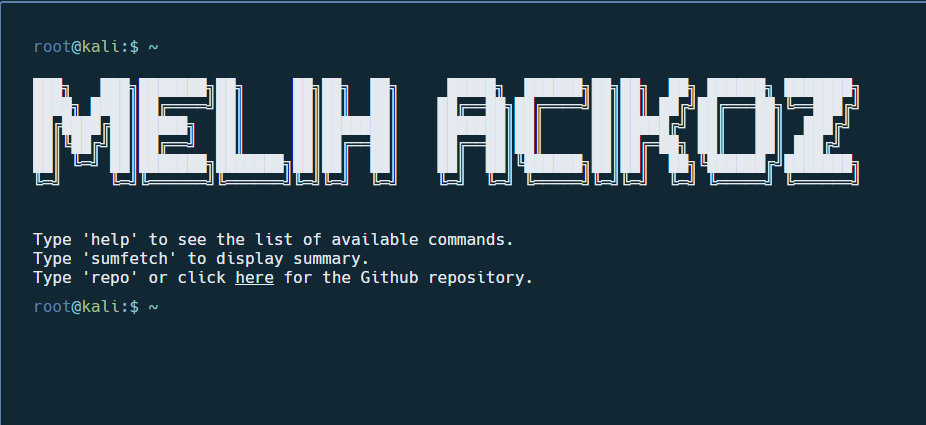

# [💻 MelTerminal ](https://google.com)

Highly customizable, easy-to-use, and minimal terminal styled website template, powered by Next.js.

## 📸 Showcase

<p align="center">
<br>
<strong>Screenshot of the website</strong>
</p>

## 🚀 How to build it

It requires the `yarn` package manager. You can install `yarn` [here](https://classic.yarnpkg.com/lang/en/docs/install/).

```bash
yarn install
yarn dev
```
